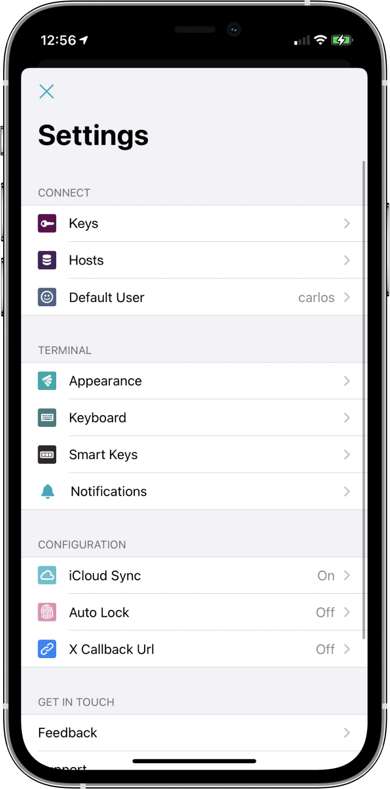
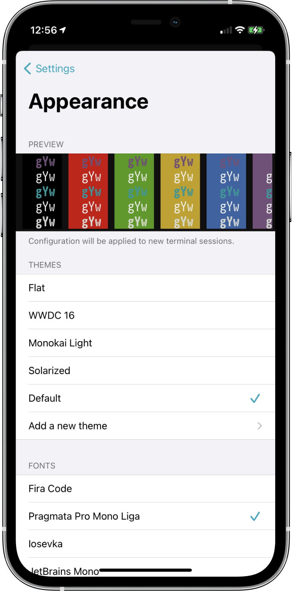

# Customizing Blink Shell Appearance 

**Warning: All changes in this section will take effect in a new Blink Shell tabs/windows!**

To open the configuration section, type `config` within Blink Shell or press `⌘-,`, and go to `Appearance`.

In Appearance section, you can configure the following:

## Themes

You can choose from basic themes that come bundled with Blink Shell or install one from our [themes gallery](https://github.com/blinksh/themes):

- Go to `Settings` -> `Appeareance` -> `New Theme` -> Paste the raw URL to theme, and download it -> `Save` and select it from the themes list

More advanced users can create own themes, you can read more about it [here](/advanced/creating-fonts-and-themes#create-a-shell-theme).

## Fonts

Blink Shell comes bundled with most popular open source monospace fonts used in terminals.
In addition we offer our beloved PragmataPro, and option for installing own fonts.

### Installing own fonts

In iOS you can use your own fonts that are in the Open Type or True Type formats.

One of the ways of doing that is by using [Fontcase](https://apps.apple.com/us/app/id1205074470?ls=1&mt=12&uo=4&pt=8934&at=10l4G7) application which is [open source](https://github.com/manolosavi/xFonts), and installs fonts using system profiles. Second one is by using applications like [Adobe Creative Cloud](https://apps.apple.com/us/app/adobe-creative-cloud/id852473028) that have huge library of fonts to chose from(but requires subscription), and installs them to `iOS Settings` > `General Settings` > `Fonts`.

### Using Fontcase

- Tap on the `Import` button in the top-left corner
- Navigate and select fonts you want to install
- You can manage fonts on the list, and remove them in necessary
- Taping the `Install` button will open a web browser with a `Download Fonts` button
- Click `Allow` for installation
- Open the iOS `Settings`, and navigate to `General` > `Profiles` > `Downloaded Profile` > `Fontcase Installation`.
- After tapping the button you’ll see a `Not Signed` highlighted in red
- Tap on `Install` button
- Enter your passcode, you will be warned that the profile is unsigned. Tap `Install`, then tap `Install` again

Go to Fontcase [help](https://github.com/manolosavi/xFonts/blob/master/xFonts/Help.md) for more in-depth help.

### Using Adobe Creative Cloud

- Download the [Adobe Creative Cloud](https://apps.apple.com/us/app/adobe-creative-cloud/id852473028) app for iOS/iPadOS
- Create an account, if you don’t have it already
- Tap the `Fonts` tab in the bottom bar
- Tap `Install Fonts` under one that you like, tap `Install` again

That's it, you can now start using new fonts inside Blink.

_Info: Limited free fonts are available without a subscription._

More advanced users can create own CSS files with fonts, you can read more about it [here](/advanced/creating-fonts-and-themes#create-a-font).

### More Options

- **Font Size**: Default font size inside Blink Shell windows
- **External Display Fonts Size**: Default font size on external displays
- **Enable Bold**: Enabling bold fonts
- **Bold as Bright**: Use bright colors on bold fonts
- **Cursor Blink**: Constantly blink cursor
