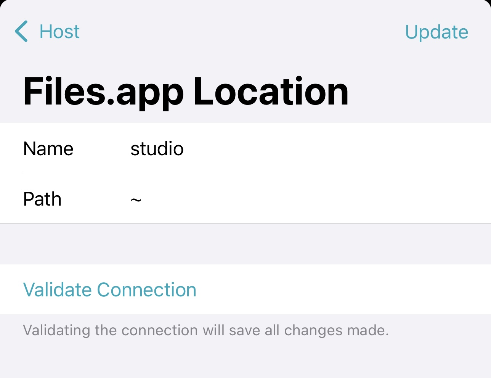

import { Callout } from 'nextra-theme-blinkshell'

# Files.app integration

Blink’s File Provider integration delivers unmatched file management on iOS. By combining the power of a File Provider Extension with advanced SFTP and CLI tools, it’s the only solution that offers desktop-class synchronization, alongside granular control for bulk operations.

The Replicated File Provider extension allows you to connect your remote file systems directly to the iOS Files.app. Browse, quickview, and manipulate remote files as if they were stored locally. Thanks to automatic syncing, uploads and downloads happen seamlessly in the background, ensuring your files are always up to date. The Files.app integration also enables you to access these files from other iOS applications, such as attaching them to emails, sharing them through messaging apps, or editing them in  productivity tools. Offline support further enhances this functionality, allowing you to work uninterrupted, even when disconnected.

For power users, Blink provides full CLI access to your remote files. Kernel-level integration ensures tools like ls, cd, find, and vim work with remote systems, enabling you to edit and manage files directly from the shell.

In this article, we’ll guide you through how to set up and use the File Provider to integrate remote file systems into your iOS workflows. From syncing with Files.app to working with remote files in the shell, we’ll cover everything you need to get started.

## Access from the Files.app

1. Go to **Config > Host**.
2. Scroll to the bottom to find the **Files.app extension**.
3. Tap "Add Location" to add the Home folder.

4. Open the Files.app and flip the switch to view the new provider.

You can now browse, upload, and download from your remote file system as if it was any other location in your device.

Blink supports multiple hosts and multiple locations per host in the Files.app sidebar. You can customize each location by configuring its name and the path it points to. Access these settings by tapping on the location. If you encounter connection issues, use the "Validate Connection" option in the same screen.

<Callout>
PRO tip: Use [Tailscale](www.tailscale.com) to access those machines not accessible through a Public IP.
</Callout>

### How to Delete a Location

To delete a location, swipe it left. This will immediately remove the current replica, including any downloaded files, and any synchronization state. Use this option if you want to clear downloaded files or start fresh. Note that local files pending synchronization will also be immediately removed, and changes will be lost, so be aware of the synchronization status or move them elsewhere before deleting the location.

## Access from the Shell

To access remote files from the shell, start by bookmarking a location. (See the [Bookmarks article](#) for details.) Once bookmarked, a symlink to the location will appear in your Home folder. You can then navigate to this symlink to access your remote file system.

From the shell, you can use familiar CLI tools such as `cd`, `ls`, and even native `vim` to interact with files. To open a share sheet directly from the shell, use the `open` command.

Note that while using the Shell to access files, changes from your device to the remote will synchronize automatically, but changes from the remote will require you to open that location within the Files.app. This is due to the lifetime of the extensions inside the iOS system.

## Access from Other Apps

The updated Replicated File Provider extension allows you to access remote file systems from within other apps, making integration seamless across your iOS workflows.

- Open the Blink Extension in the app you’re working with to browse your remote file system.
- Remote and local changes are automatically synchronized whenever files are accessed, ensuring you always work with the latest versions.
- This feature is particularly useful for tasks like attaching files to emails or editing remote files directly in other apps.

The remote file system can also be accessed from the *Shortcuts app* to automate various operations like:
- Create backups by downloading directory structures from a remote system.
- Upload files generated as output from Shortcut workflows.
- List directory contents and perform specific actions on selected files.

## How it works

The Replicated File Provider extension is designed to efficiently manage your remote file system while giving you flexibility and control. Thanks to unique file system features, the extension can separate lightweight operations, like listing directories, from heavier ones, such as accessing file contents. This ensures that your device doesn’t unnecessarily consume space or bandwidth when exploring remote file hierarchies. Be cautious when using commands like `grep` or other tools that may traverse large directories, as they could trigger extensive downloads.

The extension tracks currently visited locations and automatically triggers a pull every 5 seconds to check for changes on the remote system. This ensures that when re-visiting a folder, previously downloaded files remain up-to-date. If you make changes locally while offline, the system applies them to the remote replica automatically as soon as your device reconnects to the network. The system follows a last-change-wins policy, which ensures that the most recent modifications—whether local or remote—are preserved.

Offline access is supported through the replica, making it an excellent tool for workflows that require temporary disconnection. Files you’ve already downloaded are accessible even when your device is offline, and any changes made locally will automatically sync back to the remote system once you reconnect.  For example, you can edit a document locally while traveling, and Blink will synchronize those changes back to the remote server once you're back online.

Downloaded files are stored locally on your device and managed by the iOS system. The system dynamically allocates and reclaims storage as needed, ensuring efficient use of available space. This means that files you’ve accessed may be removed automatically by the system when storage is required elsewhere. If for security you need to immediately clear all downloaded files, you can remove the Location.

When uploading files, the extension first places the file in a temporary location ($HOME/.blink.tmp.xxx) before moving it to its final destination. This approach ensures that partial uploads or interruptions do not affect the integrity of the target directory. In the event of errors during the upload process, any leftover temporary files are automatically cleaned up by the extension. This cleanup occurs regularly, including each time the extension starts, maintaining a tidy and reliable file system.

The replica is designed to be eventually consistent with the remote. This involves numerous background operations to assess the remote's current state and determine the necessary actions to maintain synchronization. Even though the system parallelizes most operations (up to 8 at the same time), due to the multiple context changes, targeted workflows like SFTP for bulk downloads or uploads will always be more performant.

## Troubleshooting and Monitoring

If you encounter issues while using the File Provider extension, here are some steps to help you resolve them:

- **Verify the connection**: Use the "Validate Connection" option in **Config > Host > Files.app configuration** to ensure the connection to your remote system is active and properly configured. The UI will display the proper error in case it couldn't connect.

- **Check logs**: If running into syncing issues, please check the provided logs. Logs for the syncing state can be found in the `.blink` folder, prefixed with `fp-<location_name>-<location_id>.log`. These logs provide detailed information about the syncing process and can help identify any problems.

- **Errors**: The Files.app uses different icons to indicate the synchronization status of the replica. Failed operations are automatically retried by the system at varying intervals before being marked as failed with an exclamation icon. Any changes made to the remote or local files will automatically trigger a retry. Errors are expected to be rare, and most operations should eventually succeed. For troubleshooting specific issues, refer to the logs for more detailed information.
