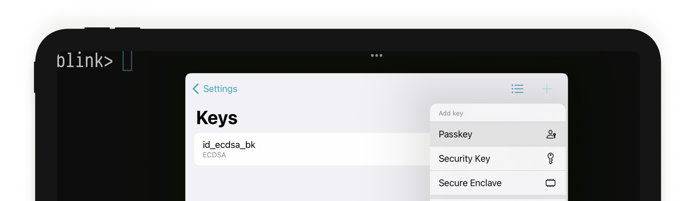
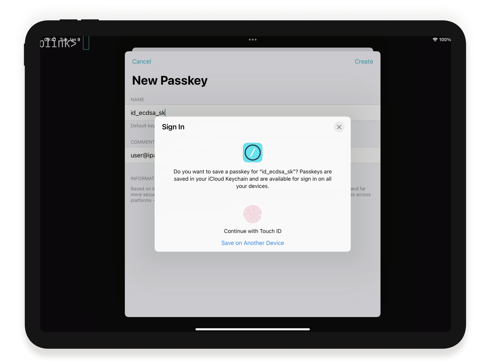
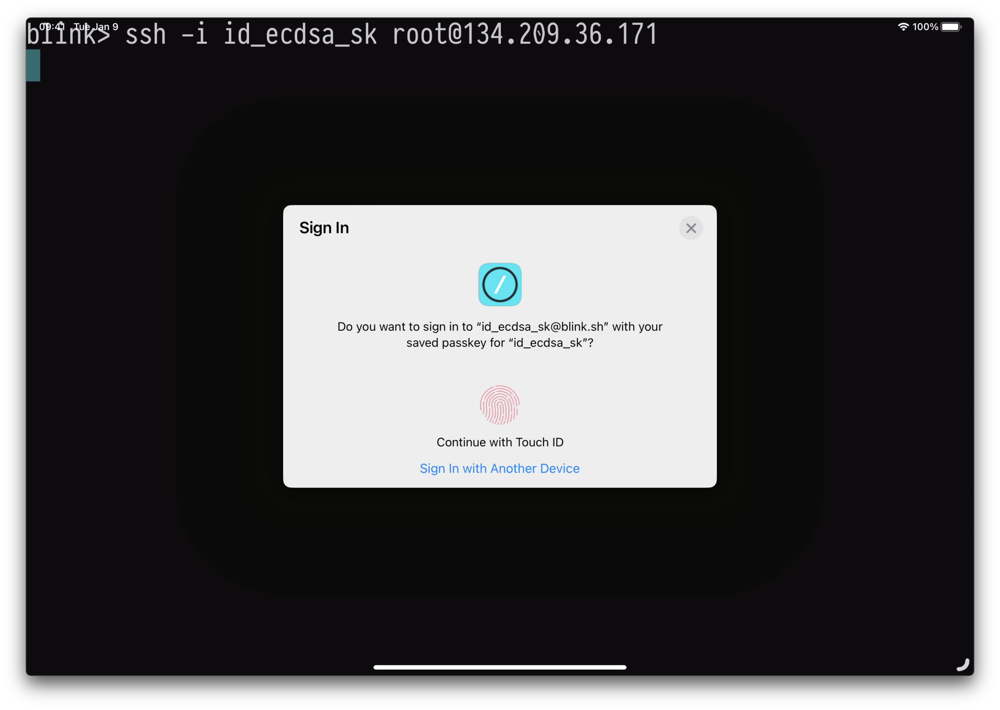
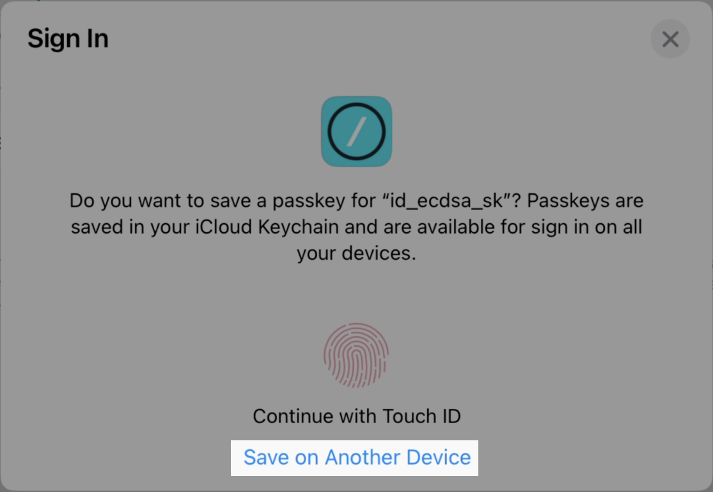
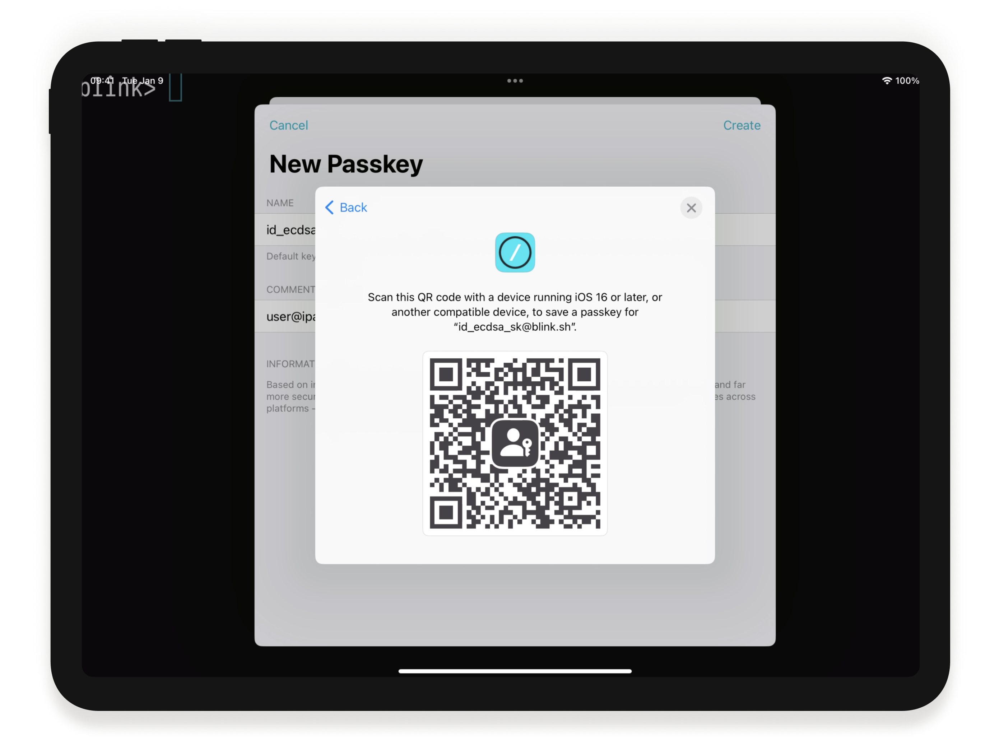
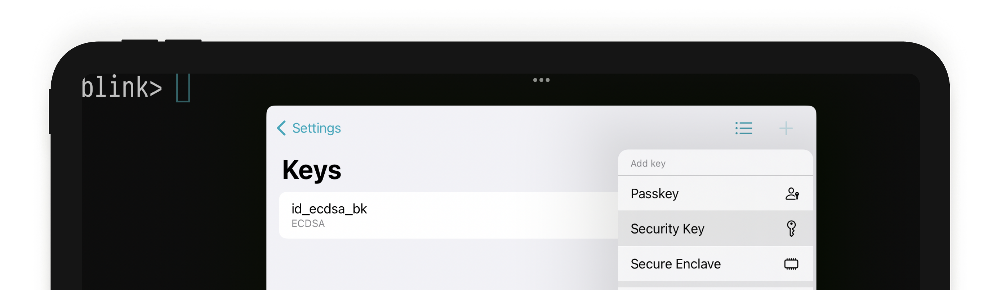
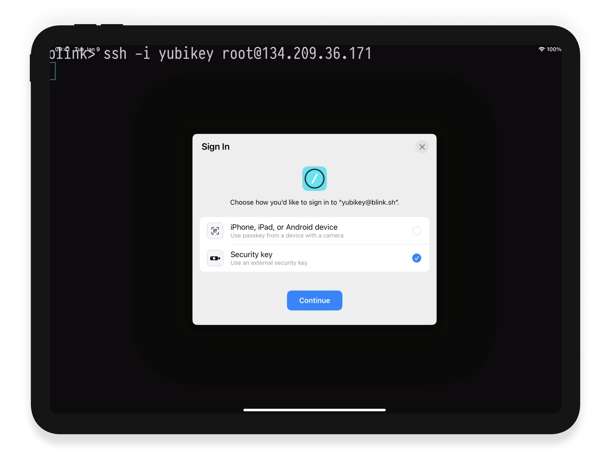
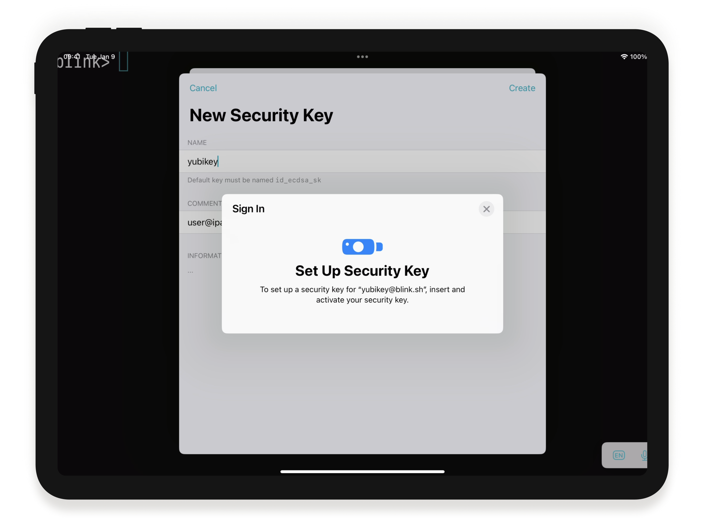
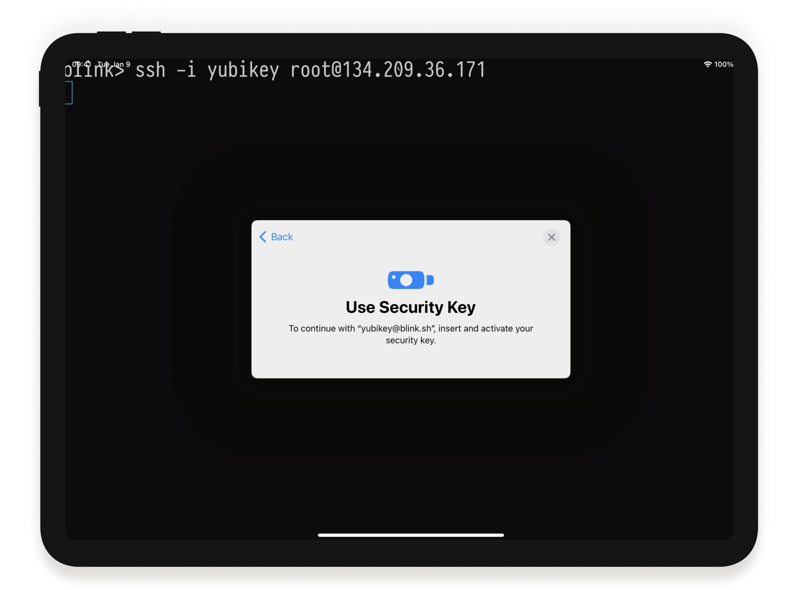

# WebAuthn for SSH: Using Passkeys and Secure Keys

WebAuthn keys rely on Public Key cryptography, so these keys are as secure as your usual ECDSA keys. Their advantage is that they leverage the [Web Authentication API](https://webauthn.guide) standard, making them portable between your devices and accessible through hardware Secure Keys. Blink makes it very easy to leverage them. You can see it in action on this Twitter thread.

<blockquote class="twitter-tweet">
Waiting for <a href="https://twitter.com/hashtag/iPadOS16?src=hash&amp;ref_src=twsrc%5Etfw">#iPadOS16</a>? Try some <a href="https://twitter.com/hashtag/iOS16?src=hash&amp;ref_src=twsrc%5Etfw">#iOS16</a> goodies on Blink this weekend… SSH auth using <a href="https://twitter.com/Yubico?ref_src=twsrc%5Etfw">@yubico</a> <a href="https://twitter.com/hashtag/yubikey?src=hash&amp;ref_src=twsrc%5Etfw">#yubikey</a>? ✅ Working on iPhone over NFC? ✅ Working on iPad over USB-C??!?!? ✅ <a href="https://t.co/usNW8HCNEF">pic.twitter.com/usNW8HCNEF</a>
&mdash; Blink Shell (@BlinkShell) <a href="https://twitter.com/BlinkShell/status/1570427813819486212?ref_src=twsrc%5Etfw">September 15, 2022</a></blockquote> 

## Why WebAuthn keys

For years, the first step to protect SSH access was to move from passwords to asymmetric public keys. Then, specialized hardware keys, [Yubikey by Yubico](https://yubico.com) being the most recent proponent, offered additional protection to the Public Key Infrastructure, moving keys from your local drive to specialized hardware and offering two-factor authentication. iOS has offered varying support for Secure Keys, but up until now, it has been very limited as it required external SDKs.

While you were busy building amazing things, Apple introduced [Passkeys at WWDC22](https://developer.apple.com/videos/play/wwdc2022/10092/), and we were very excited. Apple designed Passkeys on top of the Web Authentication API standard, building on top of many years of innovations in protocols and secure keys. The standard provides a flow to use authentication with public key cryptography, moving away from passwords and secure second-factor authentication. With Apple's legendary design and access to millions of devices, it could become what the WebAuthn standard needs to take off as the future of authentication.

OpenSSH server has had built-in support for WebAuthn keys since 8.2. At Blink, we have worked on the first client implementation in the wild. But living on the edge sure comes with a few limitations, so do not miss the Known Issues section to find out if this new type of key is for you.

## Creating WebAuthn keys

You can create WebAuthn keys to use with Blink for SSH authentication in two ways:

### Passkeys

Open `config` > `Keys` and press the Plus (+) button to create a new Key. At the dropdown menu, select `Passkeys`.

Type a name to identify your key and press `Create`. iOS will validate your identity and subsequently create a key for you. 

If you tap into the newly created key, you will see that the public key identifies itself as `sk-ecdsa-sha2-nistp256@openssh.com`. Passkeys only support one type of algorithm (ECDSA) and curve (P-256). Reading the Private Key is impossible, as with Secure Enclave keys.

To use the key, make sure you copy the public key into the server, and call SSH as you usually do. iOS will present the screen below to validate your identity and authenticate you in the server.

### Passkeys in a secondary device.
In this scenario, you store the Passkey in a different device, and when connecting, that device will automatically receive an authentication request. As a secondary device needs to be present, it effectively becomes an authentication token, almost in a two factor authentication fashion.

To start, follow the previous steps, and when iOS tries to validate your identity to create the key, at the bottom select `Save on Another Device`.

The next screen will present a QR code you should scan from the alternate iPhone or iPad you want to become your authentication token.

To use the key, make sure you copy the public key into the server, and call SSH as you usually do. This time, your secondary device will automatically ask for authentication. After validating your identity, it will log you in.

### Secure Keys
In this scenario, an external Secure Key, like [Yubikey](yubico.com) or [Titan](https://cloud.google.com/titan-security-key) is used to enable hardware-backed SSH authentication. 

Open `config` > `Keys` and press the Plus (+) button to create a new Key. At the dropdown menu, select `Secure Key`. 

Type a name and press `Create`. When asked where to create the key, select `Security Key`.

iOS will prompt you to introduce the Secure Key and validate your presence by tapping or typing a PIN code. 

If you tap into the newly created key, you will see that the public key identifies itself as ``. Secure Keys only support one type of algorithm (ECDSA) and curve (P-256). Reading the Private Key is impossible, as with Secure Enclave keys.

To use the key, make sure you copy the public key into the server, and call SSH as you usually do. iOS will present the screen below to introduce the key and validate your pressence by tapping or typing a PIN code. After the validation, you will be logged in.

## Known Issues

- In order to use WebAuthn keys for authentication, the server needs to run OpenSSH server > 8.2. macOS ships a version of OpenSSH that does not have support for secure keys compiled. In this case, we recommend installing openssh-server using Homebrew.
- Your Secure Key must support the WebAuthn protocol and be verified to work on iOS / iPadOS. Models with NFC will only be supported on iPhone. Models with USB-C will only be supported on iPad.
- This is a new feature in iOS16 / iPadOS16. Although all Secure Keys should work, there may still be bugs during creation or signing. Ie, the Titan Key may not blink when signing in some cases. Please try your model and let us know so we can report back. (Issue)
- This is a new feature in OpenSSH, and we seem to be the first client implementation as well. We are aware that Agent Forwarding currently does not work for this type of key. Please report to us if you see any other misbehaviors, we will try to fix them within our possibilities.
- Because the keys require user interaction, they will not yet work with Blink's Files.app integration or Blink Code. (We expect to fix this in the future, please upvote the Issue right her
