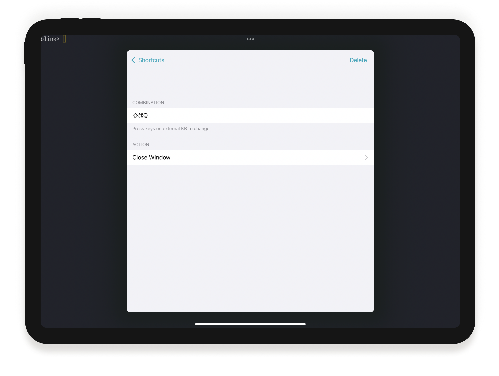
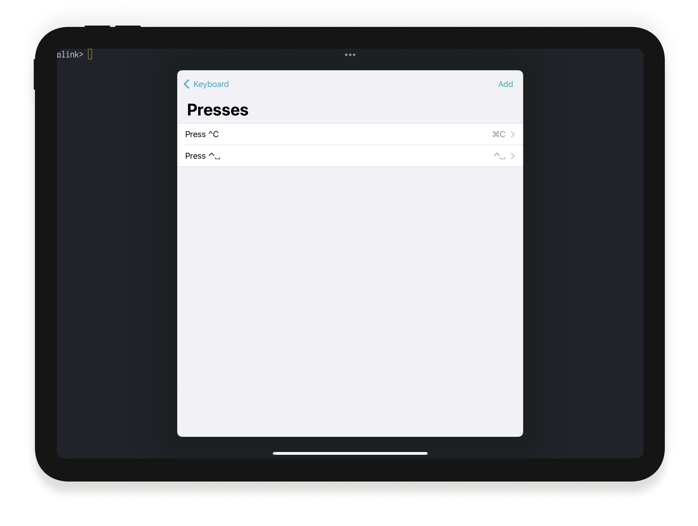
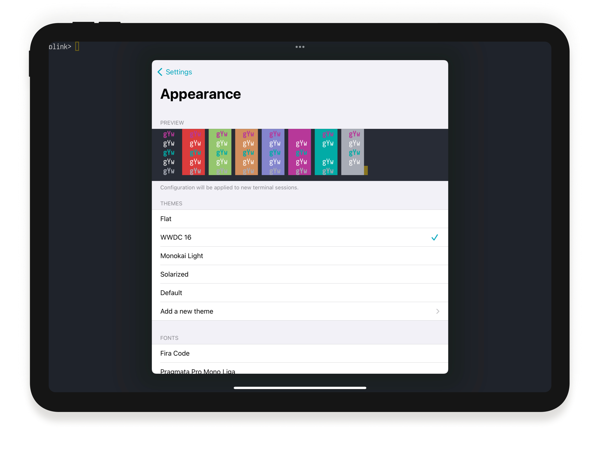

# Customizing Blink Shell

Customization is one of Blink touchstones. When starting development, we made sure we were able to customize everything even before we wrote a line of code. That’s how important it was for us.

We know it is important for you too. Having a keyboard the way you want, is second nature. Themes that don’t hurt your eyes so you can use them to code all day. Or the Font that you feel most comfortable with, whether it is more condensed or extended.

Let's walkthrough all the ways you can have Blink work for you. To get started, run ‘config’ into one of the terminals.

# Keyboard

Within Blink, you can customize from Blink Shortcuts like “Open terminals” or “Copy - Paste” to sequences and modifiers that are sent to a terminal. You can find all the keyboard configuration under the “Keyboard” settings.

## Blink Shortcuts

You can fully control Blink with your keyboard. Great when you don’t want to distract from what you are doing. Sometimes terminal apps like Vim or Emacs use a big amount of keyboard sequences that may “collide” with Blink Shortcuts. That’s why we allow you to customize them.

Start by opening the Blink Shortcuts section. There you can see the list of all shortcuts. To change one, just tap on it. Press the new keyboard sequence you would like to use, and Blink will automatically capture it.

**Pro tip:** On the On-Screen keyboard, Blink also offers a Cmd key - it is the `⌘` symbol. So all the shortcuts that are available on the external keyboard, are also available in your device.

## Custom Keyboards

iOS and iPadOS can install custom software keyboards. Sometimes those are convenient to write on, but not very good for a terminal. You can disable those by just turning off the switch.

## Modifiers

Here is where Blink shows all its power. Modifiers are keys that when pressed in combination with others, they Modify the sequence being sent, for example, Ctrl-x or Ctrl-v. Usual hardware keyboard layouts aren’t very UNIX friendly. Keys like control are too far away and small, other keys like Opt-Alt-Meta may be too small.  iPad keyboards do not even have an Esc key!

Within Blink you can configure other Modifier keys, like Caps, Cmd, etc… to replace Ctrl or Alt sequences. This is very common on Emacs where Ctrl or Esc are usually mapped to Caps and Alt.

In the Modifiers section there is a list of Modifiers that can be adjusted. To configure one, just tap on it. Some keys are on both sides of the keyboard, like Ctrl, and Blink allows you to assign different modifiers or actions to each. With Blink you can also send a “keypress” instead of a modifier sequence, so for example, you can make Caps send Esc when pressed, but Ctrl when used together with other key.

Here are some common configurations for specific users:

**Pro tip:** On the On-Screen keyboard, Blink offers `Ctrl`, `Esc` and `Alt` modifiers too. You can read more about it at [Navigation](basics/navigation).

## Custom presses

As we mentioned, there is no Esc on iPad keyboards. There are also no function keys. Some external keyboards also don’t have a very convenient placement of important keys like | or \ >. Blink to the rescue again. Within the Custom presses section you will be able to remap single key presses into other sequences.

# Appearance

**Warning: All changes in this section will take effect in a new Blink Shell tabs/windows!**

Let's move on to `config` and go to `Appearance`. Blink ships with a good set of themes, so you can select one that is to your liking and easier on your eyes.

## Themes

Blink only ships a few themes, but opens the door to create and install yours. Make sure to visit our [themes gallery](https://github.com/blinksh/themes).

To install a theme go to `New Theme` -> Paste the raw URL to theme, and download it -> `Save` and select it from the themes list.

More advanced users can create own themes, you can read more about it [here](/advanced/creating-fonts-and-themes#create-a-shell-theme).

If you would like to remove a theme, just swipe left.

## Fonts

Blink shows all the Monospaced fonts that are already installed on your device and it comes bundled with most popular open source monospace fonts used in terminals.

By default, Blink uses our beloved Pragmata, an optimized font for shell and development with a lot of special characters. It also includes ligatures, so special characters have a special more pleasant appearance.

As with themes, if you don’t find one to your liking, you can also install and use other fonts. There are two ways to do that. You can use an app like Fonts to install your font inside the system so it is available on every application.

More advanced users can create own CSS files with fonts, you can read more about it [here](/advanced/creating-fonts-and-themes#create-a-font).

If you would like to remove an installed font, just swipe left.

### More Options

- **Font Size**: Default font size inside Blink Shell windows
- **External Display Fonts Size**: Default font size on external displays
- **Enable Bold**: Enabling bold fonts
- **Bold as Bright**: Use bright colors on bold fonts
- **Cursor Blink**: Constantly blink cursor
