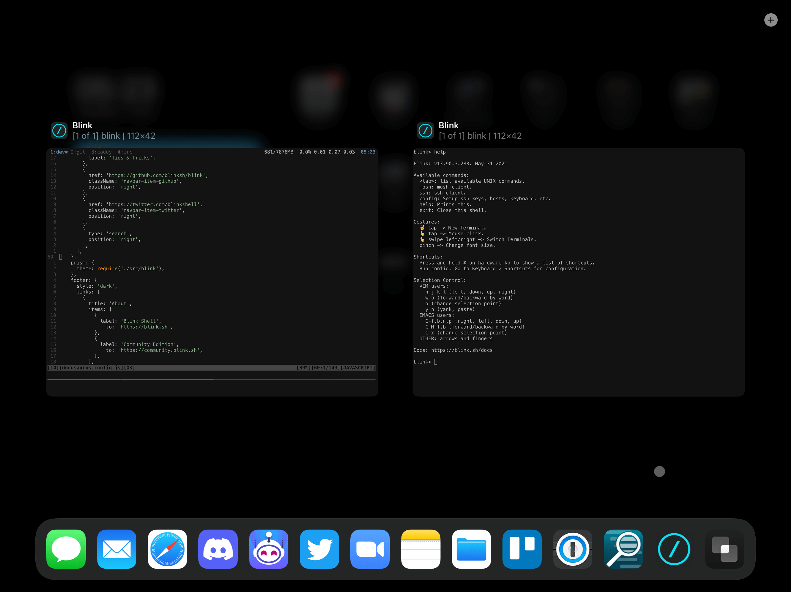

# Tips and Tricks

## Basics 

### Serving development website over HTTPS

Fastest way of using HTTPS on remote machines for development is with the Caddy web server. First install it as an executable, but not service, then create Caddyfile with reverse_proxy line like this:

```json
example.com {
  reverse_proxy 127.0.0.1:1313
}
```

Or start Caddy directly in reverse-proxy mode from CLI:

```bash
sudo caddy reverse-proxy --from example.com --to 0.0.0.0:1313
```

### Starting TMUX/Screen on session start

Adding startup commands is as easy as going to Host settings, scrolling to bottom and inserting command we want to use:

```shell
tmux a -t session_name
screen -rd session_name
```
Or anything other that we want to run when starting a new session. It also can be run from Blink command line:
```shell
mosh host -- tmux a -t session_name
mosh host -- screen -rd session_name
```

### SSH port forwarding from remote machine to iPad

Forwards connections from a port on a local system to a port on a remote host:

```bash
ssh -L 3000:localhost:3000 ssh-host
```
### Blink: Using screen corners

Taping three fingers on the screen will bring a Blink menu in which you can set the Cover, Fill, and Fit setting, adapting Blink to different screens and devices.

- Cover: Edge to Edge
- Fill: Space at the Top and Bottom
- Fit: 5 points on all sides


### External Display: Apple TV

You can use Apple TV as a second monitor, just start screen share on Apple TV and Blink will use it as second monitor, not just mirroring. This is really cool if you are doing a presentation, or if you are on the couch with your phone and want to have a bigger display!

### External Display: Split View

For the external display to work, Blink needs to be an active window on the iPad. A very cool way to do this is to use Split View on the iPad, giving Blink ½ or ¼ of the screen, while the rest can be taken by Safari or anything else you need!

### Display: What is Blink Window? 

From iPad OS 13, we have multiple windows support inside Blink, and each window can have infinite tabs. 


You can also move tabs between the iPad window and External Display window with `⇧ Shift + ⌘ Cmd + O` or change focus to the other window using `⌘ Cmd + O`.

### Keyboard: Separate Keys

By switching off the "Same for both sides" option in Config > Keyboard > ⌥ Option you can use one key as a `Meta` and the second as a normal `⌥ Option/Alt`. It's particularly helpful for users that use languages containing diacritic letters.

## Advanced

### Inline Images

Blink supports displaying images over SSH when using [iTerm2 imgcat](https://iterm2.com/utilities/imgcat). Put it in local .bin folder ($HOME/.bin or any other in your %PATH) and use it as this:

```bash
imgcat image.png
```

**NOTE: This does not work in terminal multiplexers (TMUX, GNU Screen) or inside Mosh.**

Alternative that works inside every environment, but needs Rust installed is VIU. Install it using Cargo:

```bash
cargo install viu
```
And use:

```bash
viu image.png/animation.gif
```
More information: [VIU GitHub Repository](https://github.com/atanunq/viu)

### Emacs: Custom Presses

Using the Config > Keyboard > Custom Presses settings you can add new shortcuts. For instance, sending `ctrl-space` when hitting `ctrl-space`, as opposed to bringing up iPadOS's emoji menu. Now Emacs cut & paste doesn't need to rely on `ALT - x set-mark-command`.

### Emacs: Change ALT to Meta

Change "Press send" to **None** and "As modifier" to **ESC** option in Config > Keyboard > ⌥ Option so you can use it as `Meta`. From now on `⌥ Option/Alt - x` will work as `Meta - x`.
