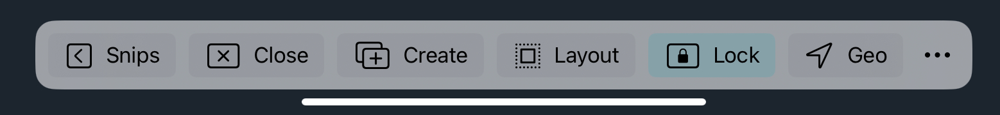
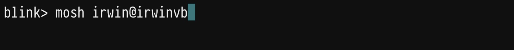
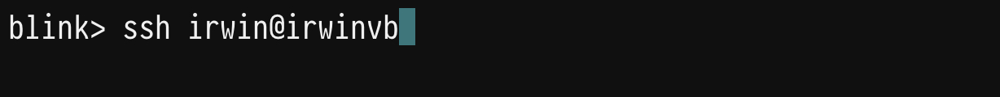

# Quick Start Guide

## Installing Blink Shell

1. Download Blink Shell on the App Store:

2. Start a Free Trial of Blink+Build or buy Blink+, the Shell of choice for developers, depending on your needs.

## Navigating Blink Shell

Welcome! You can now start using Blink. Here is a quick tour:

1. Works like other terminals, type in your commands and hit Return.
2. Navigate command history with the `up` and `down` arrow keys.
3. Type `help` to get a quick list of available [commands](basics/commands) and features.

## Gestures

**Touchscreen gestures:**

1. To create a new shell, tap the screen with two fingers ✌️.
2. To switch between active shells, swipe side to side ⬅️👆➡️.
3. To adjust size of current terminal, pinch the screen 👌.
4. To start selection mode, Tap and drag 👆🔘🔼.

   You can drag selections to other apps!
   
   Or from other apps into Blink, it is pasted where the Blink cursor is located.

5. To show the Context bar, tap the iOS Home Bar twice or press `CMD ⌘` twice.

      In the bar you can: Create or Close a tab, access Snips, and toggle Lock and Geo.

      Change the Context Bar appearance in the `…` menu.

## Keyboard shortcuts

   If you have a keyboard connected, press and hold `CMD ⌘` key to see available shortcuts.

## SMART KEYS

Smart Keys is **only** visible when using the on screen keyboard. It's hidden when using an external keyboard.

**Smart Keys available:**
1. Modifiers: `CTRL ^`, `ALT ⌥`, and `ESC ⎋`.
2. Direction arrows.
3. Tap `CMD ⌘` to view functional keys. 

## Configuration

To access the Settings menu type `config` in the shell or press `CMD ⌘` and `,` together.

**The settings menu has the following:**

- Host: create hosts that can be accessed with only the hostname. [Read more.](basics/hosts)
- Keys: Create SSH key pairs for a more secure, password-less access to your servers. [Read more.](basics/ssh-keys)
- Appearance: Style your terminal with [themes](basics/customize#themes) and [fonts](basics/customize#fonts).
- Keyboard: add shortcuts, modifier keys and custom key presses.
- Get in contact with us through the Support or Feedback options.

## Connecting to a Server or Computer using Blink

### Mosh

1. Make sure you have mosh installed in your desired destination.
2. In Blink type `mosh [user@]hostname`. For example : `mosh irwin@irwinvb`.

   Or use the IP Address. For example: `mosh irwin@100.10.222.33`.

   [Read more about Mosh.](advanced/advanced-mosh)

### SSH
1. Make sure you have ssh set up on your desired destination.
2. In Blink type `ssh [user@]hostname`. For example : `ssh irwin@irwinvb`.

   Or use the IP Address. For example: `ssh irwin@100.10.222.33`.

3. Follow Blink instructions for password, accepting the remote host key, etc.

   [Read more about SSH.](advanced/advanced-ssh)

   Welcome to your host! If successful your terminal should now be the same command prompt as the one used on your device.

