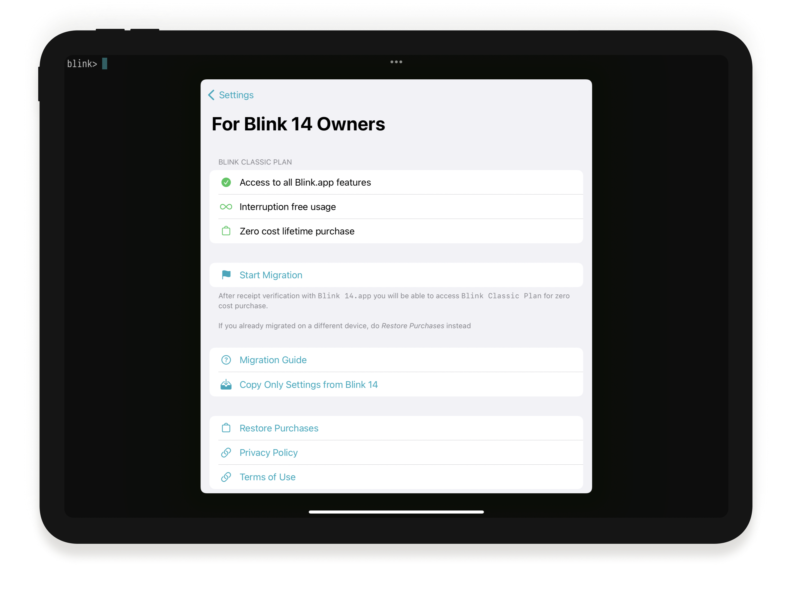
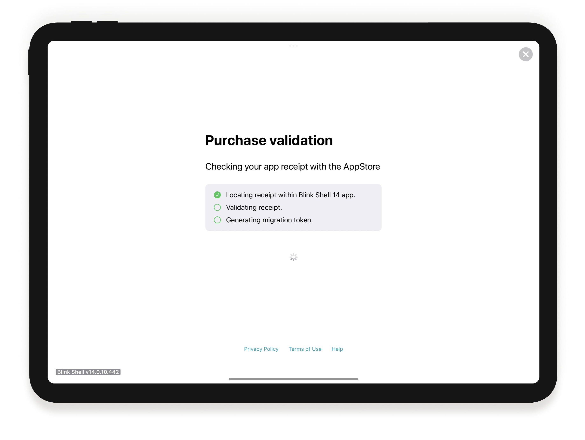
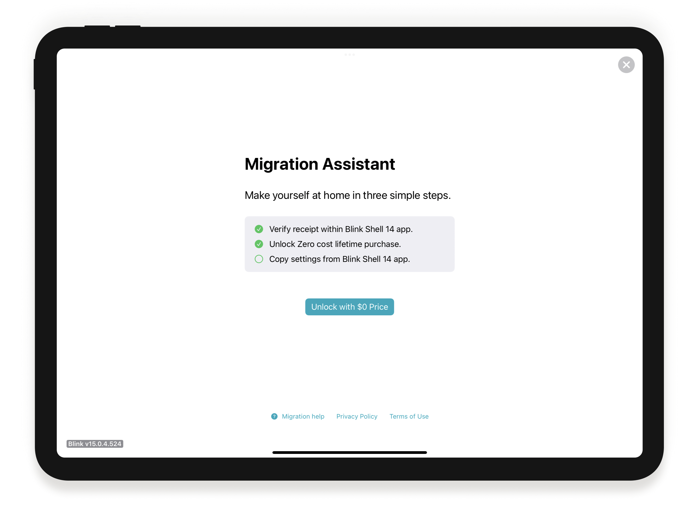
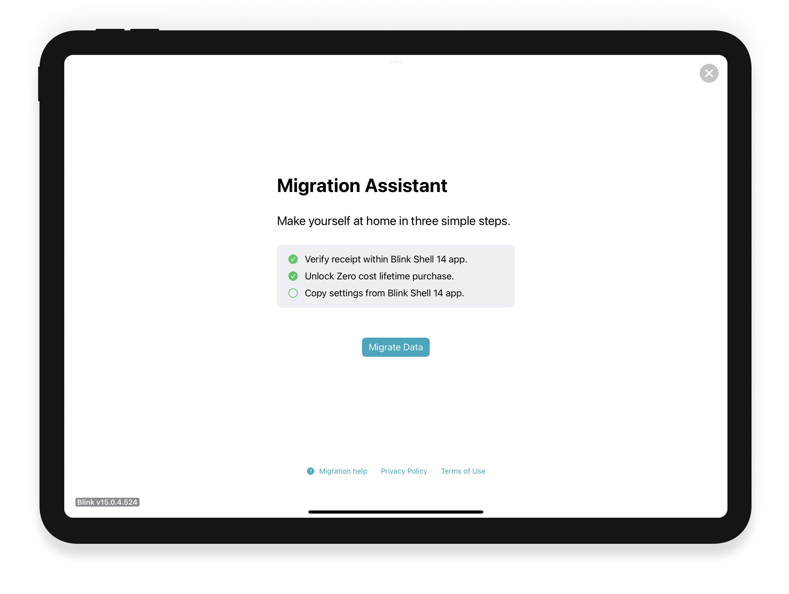
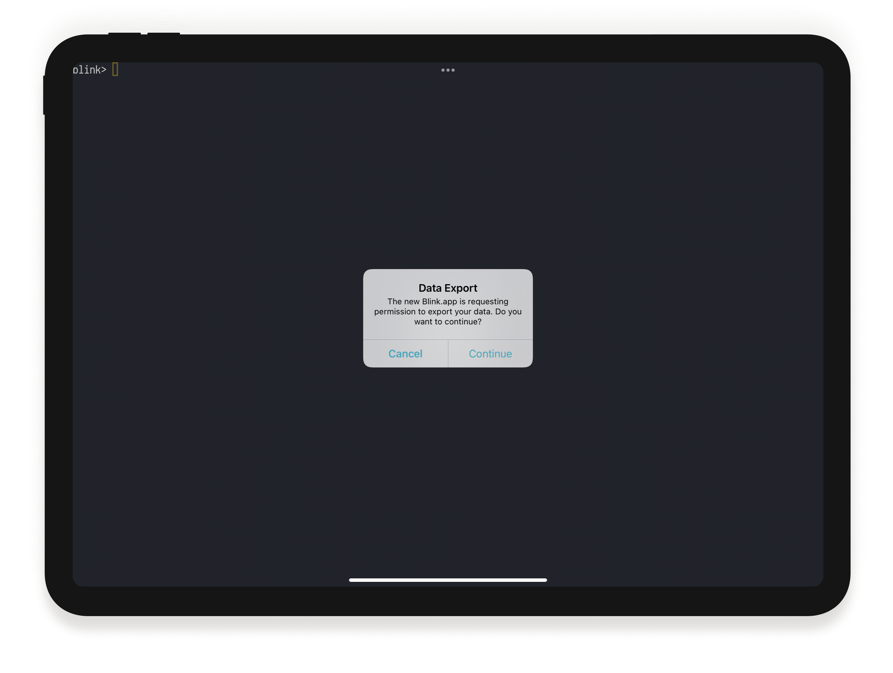
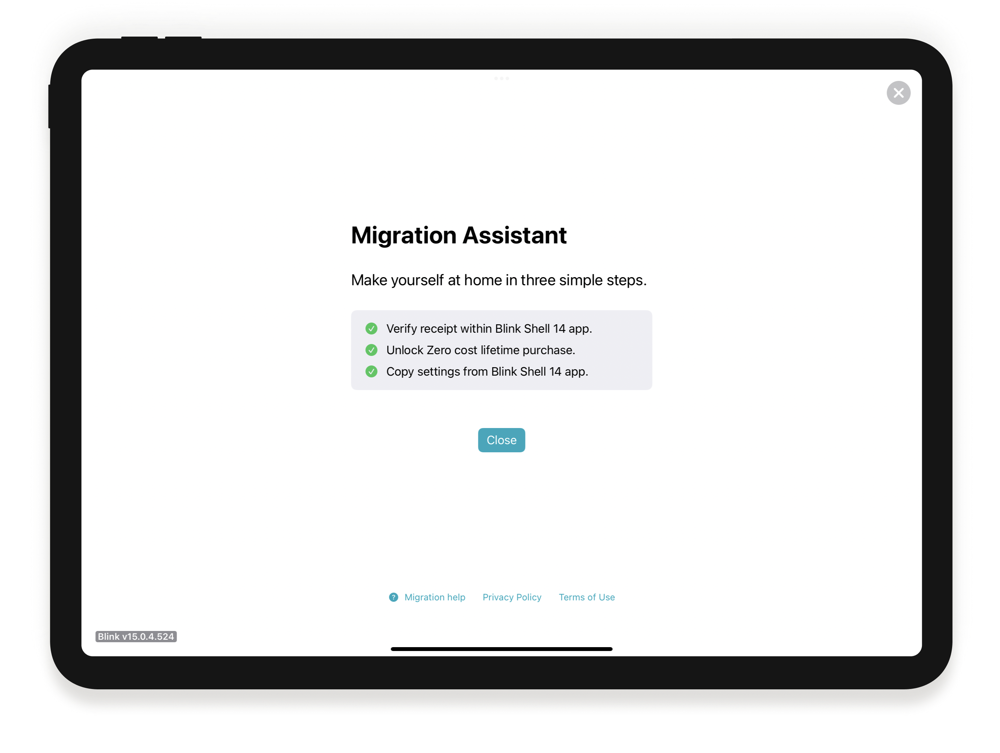

# Migrate from Blink Shell 14

On February 9th, 2022, we released a new **Blink Shell & Code** app,  the next version (15) of *Blink Shell* (14). If you purchased Blink Shell 14,  you are grandfathered in the new. You will continue receiving updates and features, just like before. It is just a one-time update, and we put a ton of effort into making it as smooth as possible.

The Migration Assistant will guide you step by step, the whole process should only take a few seconds, and there is nothing much to do other than pressing `Start`. We are happy to report that less than 0.1% of the users have had any issues so far, and please do not hesitate [to write us](mailto:support@blink.sh) if you need help.

So let's get started!

First, make sure you have both apps, installed on the same device, from the AppStore (if you are on [TestFlight read here](#what-do-i-do-if-i-am-on-testflight-is-testflight-not-being-updated-do-i-need-to-sign-up-again)). In the new Blink 15, in an empty shell, open settings by typing `config` or pressing `Cmd - ,`. Go to the `For Blink 14 Owners` section. 

There are three options:
- `Start Migration`: Will import your original Blink 14 purchase and all the Settings into the new Blink 15.
- `Copy Only Settings from Blink.app`: Will only import Settings and not the Purchase from Blink 14. [See Step #3 on how to proceed](#step-3-data-migration).
- `Restore Purchases`: If you already migrated once, this option will import the Purchase from the AppStore without requiring a second migration. After restoring, use the previous option to import the Settings on that device.

If this is the first migration, then select `Start Migration`. The *Migration Assistant* will pop up, with checkboxes for the three steps.

Let's get started by pressing `Start Migration`

### Step 1: Verify the Receipt within Blink Shell 14 app

This step does not require any intervention. The *Migration Assistant* will take you to Blink 14. There, your original Purchase is automatically validated with the AppStore and, if correct, send you back to Blink 15. Note once one device validates your Purchase, a second device will fail. To enable Blink on other devices, read [how to restore a purchase](#how-to-restore-your-purchase).

If during the validation you receive a `Receipt already exists`, [check this out for possible issues](#i-get-a-receipt-already-exits-error-on-step-1-what-does-it-mean).

### Step 2: Unlock Purchase
Blink will exchange your valid original Purchase for a $0 item. This way, you will access the same Blink Shell feature set as the Blink Plus subscription and continue enjoying upcoming updates. 

The AppStore may ask for your credentials and ask you to accept the $0 purchase.

Failures at this step are rare, but the AppStore could be having hiccups: please retry later by pressing the `Unlock with $0 price`. If the error persists, restart the app and go back to Step 1.

### Step 3: Data migration
The last step will bring your settings to the new Blink Shell & Code. Press `Migrate Data` to go ahead. Please note that this step will overwrite your current settings. In case you want to skip it, press the `X` at the top right. 

The *Migration Assistant* will take you to Blink 14, and for security reasons, ask if you want to go ahead with the export. 

After pressing `Continue`, it will take you back to Blink 15, and all your settings will have transferred. The *Migration Assistant* will now have all the checkboxes marked, and you can proceed to `Close`.

At this step, the most common issue is exporting keys. For more info, check [`Could not read private key`](#i-get-an-error-during-data-export-cannot-read-private-key).

## How to Restore your Purchase

Once you have gone through the whole process and exchanged your original Purchase for the new Blink Shell Classic, in the future or from other devices, you do not have to go through the Migration process again. 

Go to the `For Blink 14 Owners` section inside `Settings`, and press `Restore Purchases`, which will recover your Blink Shell Classic. You will see your Blink Shell Classic plan activated again if everything goes fine. If nothing happens or you have issues, try restarting the app or retry later.

As noted previously, if this is a second device, you can import your settings through `Copy Only Settings from Blink.app`.

## FAQ & Known Issues

### What is Blink Plus? Do I need a subscription now?

No. If you are grandfathered into **Blink Shell & Code**, you can access the same feature set as **Blink Plus**. Not only that, but you will continue receiving all the new updates and new features coming to the Blink.app as well. Subscription is **not** required.

**Blink Plus** includes access to services that we could not build on top of Apple's platforms and that will require our infrastructure. These will include future features to securely synchronize your keys between devices, or access to Blink Build, our instant dev environments platform in the Cloud. We will make the $20/year worth it ;)

Purchasing **Blink Plus** is also a way to continue supporting Blink development ❤️. 

### For new users, is there a lifetime version available anymore?
Our Community Version is always open to [Sign Ups](https://community.blink.sh). If you prefer to compile it yourself, we are still entirely [Open Source](https://github.com/blinksh/blink).

Our goal is to make **Blink Plus** successful and remove any restrictions from the free version. Please help us by purchasing **Blink Plus**!

### What do I do if I am on TestFlight? Is TestFlight not being updated? Do I need to sign up again?
Nothing to do. TestFlight users will be migrated to a new TestFlight app automatically very soon. Keep an eye on your inbox, and we will give a heads up in our usual channels too.

### Will there be a new app for Blink Shell 16?
No. We expect this to be just a one-time event. This app will update to 16, 17, and so on.

### I get a `Receipt already exits` error on Step 1. What does it mean?
This message means a different device has already transferred the Receipt from Blink 14 that you are trying to exchange. First, make sure you are not using the TestFlight version to migrate. Second, if this is a second device, use [Restore Purchase](#how-to-restore-your-purchase) instead. And third, restart the app and wait a little bit; the AppStore may be having issues.

If nothing works, do not hesitate to [send us an email.](mailto:support@blink.sh)

### I migrated on one device, but I got the Receipt already tran3sferred on another. Is there a one-device limit?
No. [Restore Purchase](#how-to-restore-your-purchase).

### Restore Purchase still fails on the second device. What should I do?
[Send us an email.](mailto:support@blink.sh)

### How do I "verify receipt" with the new app?
Verification happens automatically as part of the [Step 1](#step-1-verify-the-receipt-within-blink-shell-14-app). There is no manual process required.

### I get an error during data export: `cannot read private key`.
This message means that the private key is no longer reachable by the old Blink 14, and it cannot export it. It may happen if your device is new and you restored Blink from the iCloud backup. In this case, go to the `Keys` section and make sure you can copy the mentioned private keys, deleting those not available. If the key can be copied, then restart Blink 14 as it may have been just a temporary issue with the Keychain, and retry the import from Blink 15.

If copying settings still fail, you can import keys manually into the new Blink 15 and remove them from Blink 14. A migration with no keys will always succeed.

### I cannot see all my keys in Blink. What happened?
Blink will import all your keys except for the Secure Enclave keys. SE keys are more secure because they cannot be read by anyone, even the app that stores it. This security advantage is, unfortunately, a disadvantage for the migration. As a workaround, install a new key using Blink 14.

### I have iCloud sync turned on. Why can I not see my data?
Data migration does not depend on iCloud. You need to import your data, and afterward, you can turn on iCloud sync.

### My question is not here. What do I do?
[Send us an email.](mailto:support@blink.sh)
