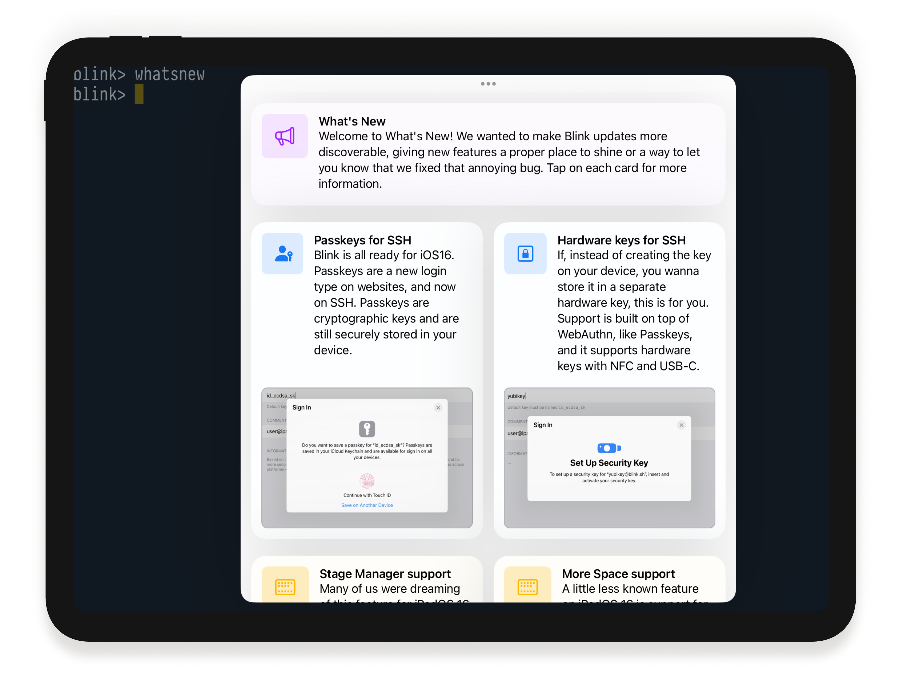

# What's New

We want to make Blink updates more discoverable, giving new features a proper place to shine or a way to let you know that we fixed that annoying bug. And at the same time, we want everyone to participate in the release flow. From the moment a version is out on TestFlight until it becomes stable at the AppStore.

Since Blink 16, after an update, Blink will remind you to run the `whatsnew` command in a new shell. This command will open the What's New window, where you can explore the changes for that version. Tapping on each card will link you to the specific Documentation for a feature or GitHub discussion for a fix.

We want you to participate in the whole release process. Please visit the [Announcements](https://github.com/blinksh/blink/discussions/categories/announcements) section in our Discussions and access all the conversations for each release.

## Previous versions

You can read the previous Changelog of Blink v14 and below, from the following [link](https://github.com/blinksh/blink/blob/raw/CHANGELOG.old.md).
